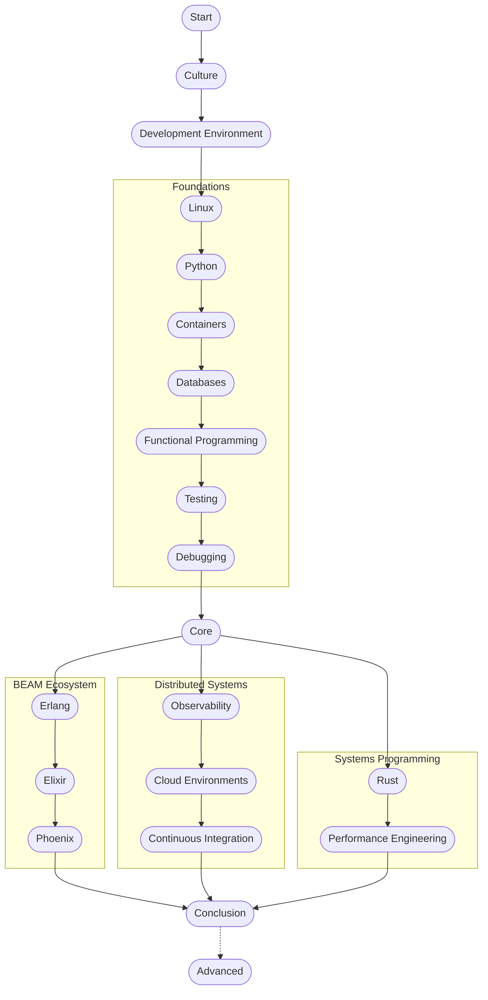

# LambdaClass Hacking Learning Path
[Hacker Manifesto](http://phrack.org/issues/7/3.html)

## Table of Contents
- [LambdaClass Hacking Learning Path](#lambdaclass-hacking-learning-path)
  - [Table of Contents](#table-of-contents)
  - [Introduction](#introduction)
  - [Our Worldview](#our-worldview)
    - [Gaming](#gaming)
    - [Machine Learning](#machine-learning)
    - [Cryptography](#cryptography)
  - [Company Culture](#company-culture)
    - [Learn to fail](#learn-to-fail)
    - [Principles for success and teamwork philosophy](#principles-for-success-and-teamwork-philosophy)
    - [Even if you work with a client you're working for Lambda at the end](#even-if-you-work-with-a-client-youre-working-for-lambda-at-the-end)
    - [Do The Simplest Thing That Could Possibly Work (aka KISS)](#do-the-simplest-thing-that-could-possibly-work-aka-kiss)
    - [Development process/workflow](#development-processworkflow)
    - [Design and coding standards](#design-and-coding-standards)
      - [GitHub \& GitLab](#github--gitlab)
    - [Working on open source projects](#working-on-open-source-projects)
  - [Tool stack](#tool-stack)
  - [Community projects](#community-projects)
  - [Development Environment Setup](#development-environment-setup)
    - [Homebrew](#homebrew)
    - [GNU tools](#gnu-tools)
    - [asdf Version manager](#asdf-version-manager)
    - [Code Editors and IDEs](#code-editors-and-ides)
  - [Foundations](#foundations)
    - [Unix Philosophy](#unix-philosophy)
    - [Linux](#linux)
      - [Networking](#networking)
      - [SSH](#ssh)
      - [Git](#git)
    - [Python](#python)
    - [Docker](#docker)
      - [Colima setup for macOS](#colima-setup-for-macos)
    - [Databases](#databases)
      - [SQL and PostgreSQL](#sql-and-postgresql)
      - [Redis](#redis)
    - [Functional Programming](#functional-programming)
      - [Referential Transparency](#referential-transparency)
      - [Immutability](#immutability)
      - [Functions as first-class citizens](#functions-as-first-class-citizens)
    - [Debugging](#debugging)
    - [Testing](#testing)
      - [Unit Testing](#unit-testing)
      - [Integration Testing](#integration-testing)
      - [Property-based Testing](#property-based-testing)
      - [Fuzzy Testing](#fuzzy-testing)
  - [Core](#core)
    - [Erlang](#erlang)
    - [Elixir](#elixir)
    - [Phoenix](#phoenix)
      - [ExCheck (QuickCheck)](#excheck-quickcheck)
      - [OpenAPI](#openapi)
      - [Projects](#projects)
    - [Distributed Systems](#distributed-systems)
    - [Observability](#observability)
    - [Cloud Environments](#cloud-environments)
      - [AWS and other cloud providers](#aws-and-other-cloud-providers)
      - [Kubernetes](#kubernetes)
    - [Continuous Integration](#continuous-integration)
      - [GitHub Actions](#github-actions)
    - [Rust](#rust)
      - [Excercise: Conway's Game of Life](#excercise-conways-game-of-life)
      - [Exercise: Rusty Merkle Tree](#exercise-rusty-merkle-tree)
    - [Performance Engineering](#performance-engineering)
  - [Advanced](#advanced)
    - [Hardware](#hardware)
    - [Parsing](#parsing)
    - [Type Systems](#type-systems)
    - [Virtual Machines and Runtimes](#virtual-machines-and-runtimes)
    - [Algorithmics](#algorithmics)
    - [Computability](#computability)
    - [Consensus](#consensus)
    - [Cryptography](#cryptography)

---
> You can choose a life of ease and comfort or you can choose a life of service and adventure - Jeff Bezos

> My algorithm has always been: You put smart people together, you give them a lot of freedom, create an atmosphere where everyone talks to everyone else. They're not hiding in the corner with their own little thing. They talk to everybody else. And you  provide the best infrastructure. The best computers and so on that people can work with and make everyone partners. - Jim Simons

> Top-down management leveraging command-and-control hierarchies are for the mahogany boardrooms of yesteryear. We are navigators, adventurers, and explorers of the future. We are married to the sea - Yearn's Blue Pill

> A boring codebase doesn't make a bored developer, on the contrary, it frees developers up to think about important stuff and deliver value to the business. Just as I want my language to be boring so I can focus on interesting stuff, I also want my tech stack to be boring - the interesting bits should be in the value added, not the stuff under that.

## Introduction
Welcome! This is a guide intended to aid employees in their first days in the company.
It will guide you in setting up expectations and working tools, and a whirlwind tour of the background knowledge and tools necessary to work on the kind of projects common at LambdaClass.

The learning path is structured as a series of topics and exercises.



## Our Worldview

### Gaming

### Machine Learning

### Cryptography

- [Lambda Crypto Doctrine](https://blog.lambdaclass.com/lambda-crypto-doctrine/)
- [Transforming the Future with Zero-Knowledge Proofs, Fully Homomorphic Encryption and new Distributed Systems algorithms](https://blog.lambdaclass.com/transforming-the-future-with-zero-knowledge-proofs-fully-homomorphic-encryption-and-new-distributed-systems-algorithms/)

## Company Culture
At Lambda we won't micromanage you because we don't want to: **we give flexibility but ask for responsibility in exchange**.
Of course, you can have days off to study, or if you feel sick, but you can also have days off if you feel brain fog, nervous, or a bit under the weather; we actually prefer it that way.

If you feel healthy and comfortable, you will be able to solve more efficiently the problems you have in front of you. And even better, you will contribute to a healthier workspace.

Nobody wants to give up, that's a common emotion. The good news is that you are not giving up, you are getting to know yourself better, so you can recharge your energies and keep learning and improving. In turn, when you are working we expect you to hit goals, be proactive, and be a valuable member of the team.

There are three key elements we want you to have present at every moment: *Communication, Accountability, and Empathy*.

- **Communication** is a key aspect of every human relationship. If you can measure your words to give a positive clear message, you can achieve anything in life through teamwork. Try labeling your emotions before communicating, since it is likely that people in front of you do not know what is going through your head. Also, be transparent but assertive if you disagree about something, it will help understand your point of view. Finally, try to avoid direct messages, working on channels allows more people to be in the loop and better feedback can be given.
- **Accountability**. Everyone makes mistakes, learners do something about them. If you get something wrong, communicate poorly, or even feel overwhelmed about a situation, raise your hand and say it. It's very likely that a process failed, not you. Many people will be there to help you sort out the issue, and you will surely learn something along the way. If you keep quiet and don't say anything you will regret it later when the truth burst through another hole.
- About **empathy**, we are all human beings and have complex emotions, if you are feeling great, it doesn't mean your colleague isn't feeling like shit. Perhaps your coworkers don't feel comfortable talking about emotions, so go talk with them and help them. You can talk to them or their manager if you feel something is going on with them. There is a time when everybody feels weak and needs someone else for support. So be a hero, be empathic.

If you are reading this, you are probably giving your first -or second- steps on the long journey towards being a good developer, but first try to be a good human being and you will see how far that can get you.

### Learn to fail
As with most projects making mistakes fast and loudly will make you learn faster, so you should not be ashamed to work directly on a repository through Pull Request rather than workshopping in a draft made elsewhere

- **Avoid google docs**. Work directly with Git, it will help get more eyes on your work to get corrections earlier.
- **Default to git**. As said earlier, Git snapshots your work and makes it more accessible to the public, more eyes means more people eager to help you

### Principles for success and teamwork philosophy
We follow a code of conduct that must be followed to ensure a safe space in the team. You signed it when you entered Lambda and we expect you to follow it. Basically, treat everyone with respect.

- [Principles for success by Ray Dalio](https://www.youtube.com/embed/B9XGUpQZY38).
- [Charity Majors - The Sociotechnical Path to High-Performing Teams](https://www.youtube.com/watch?v=oV8VSBSBrr4).
- [Antifragile: Things That Gain from Disorder](https://www.amazon.com/Antifragile-Things-That-Disorder-Incerto/dp/0812979680)
    - Chapters 1 & 15
- [Citogenesis in science and the importance of real problems](https://lemire.me/blog/2023/06/14/citogenesis-in-science-and-the-importance-of-real-problems/)
- [Data science in Julia for hackers](https://datasciencejuliahackers.com/)
    - Chapter 1
- [How to Make Your Code Reviewer Fall in Love with You](https://mtlynch.io/code-review-love/)
- [The XY Problem](https://xyproblem.info/)
- [The Biggest Mistake I See Engineers Make](https://web.archive.org/web/20220125174724/https://www.thezbook.com/the-biggest-mistake-i-see-engineers-make/)
- [The Sunk Cost Fallacy](https://thedecisionlab.com/biases/the-sunk-cost-fallacy/)
- [The most important goal in designing software is understandability](https://ntietz.com/blog/the-most-important-goal-in-designing-software-is-understandability/)

### Even if you work with a client you're working for Lambda at the end

It's commonplace in Lambda to work collaboratively with clients in the development of apps and features, so maybe you will have more day to day rapport with them than with your other Lambda coworkers. If you're in that situation you should always remember a few key things:

- Your work relation is with Lambda, not with the client so expect to get feedback from your Lambda's Tech Lead and Project Manager and not from the client, don't ask for it either.
- The relationship between Lambda and the client is managed by the Tech Leads and Project Managers. If someone from the client side makes a request to you personally via DM please contact your Tech Lead and Project Manager about it. Make sure your Teach Lead and Project Manager are in the loop for all relevant information.

### Do The Simplest Thing That Could Possibly Work (aka KISS)
Strive for solving problems in the simplest way possible. To achieve this, you first need to figure out a handful of ways to confront the issue at hand, and only then pick the one you consider will work in the fewest, tiniest steps. Afterwards, refactor. Tomorrow’s code may need to be more complex, so do everything in your power to facilitate tomorrow’s code as simple as possible. Also, while you shouldn't be blind to the future, avoid investing time and effort into developing features that are not currently necessary and might be a waste.
> "Always implement things when you actually need them, never when you just foresee that you need them" - Ron Jeffries
- [Do The Simplest Thing That Could Possibly Work](https://wiki.c2.com/?DoTheSimplestThingThatCouldPossiblyWork)
- [Yagni by Martin Fowler](https://martinfowler.com/bliki/Yagni.html)

### Development process/workflow
- There is a weekly call with every member of the team to set the most important goals of the week, as well as a daily call to focus on the problems of the daily tasks.
- When working on projects, the specific tasks to tackle are written in tickets on Github Projects. Some actual Lambda's projects are working on other project management software, but these are legacy.
- [The Manager's Path](https://www.amazon.com/Managers-Path-Leaders-Navigating-Growth/dp/1491973897/ref=sr_1_1?dchild=1&keywords=the+managers+path&qid=1625162711&s=books&sr=1-1)
    - Chapter 1 *Estimate reading time: 1 hour*

### Design and coding standards
- Suggested reading: [Coders at work](https://www.amazon.com/Coders-Work-Reflections-Craft-Programming/dp/1430219483)
- [make is the build tool](https://medium.com/@jlouis666/how-to-build-stable-systems-6fe9dcf32fc4#e398). Consider [these notes](http://gromnitsky.users.sourceforge.net/articles/notes-for-new-make-users/).
- Postgresql is the default database.
- Write tests.
- Favor integration tests over unit tests. A project's first tests should be end-to-end smoke and sanity tests, and only after that, if ever, should unit tests be written to test API's, system invariants and help pinpoint bug causes and locations.
- Do not write tests before you have solved the problem, you may waste time writing tests for the wrong implementation.
- Write for humans: coding for computers is easy, but writing code that is understandable by another person is an art.
- Code and document in english unless you have a very specific reason not to.
- Use meaningful, readable names for variables, functions, and files. Don't try to save characters.
- Documentation is a sign of the quality of an API. It's easier to write it when the design is right.
- The less code you have the better. Deleted code is debugged code.
- Aim for simplicity, not performance. The latter is a by-product of the first.
- Only introduce optimizations if you have benchmarks that prove an improvement and that the improvement is relevant in the context of the program.
- Only introduce optimizations if they represent a concrete gain (e.g. cost savings, improved user experience).
- Follow the [Zen of Python](https://www.python.org/dev/peps/pep-0020/), regardless of the language you are using at the moment. English also counts as a language.
- Don't introduce dependencies prematurely. You must evaluate your requirements, maintenance, and integration costs first.
- If you want to upgrade a dependency, test it first.
- Always lock your dependencies. Pin a specific version and a commit of a dependency, don't use the version at master.
Use git and commit often, even in one-person projects.

#### GitHub & GitLab
- If you are new to GitHub, you can put your hands on with [this course](https://github.com/skills/introduction-to-github)
- Progress in any project must be pushed every day. This must be done within a branch of the master repository and a Pull Request (PR) must be opened for reviewing the code, previous to merging the branch to master.
- Doc files should always be added via pull request.
  - Be sure those files are written in Markdown. 
  - We always use [Mermaid](https://mermaid-js.github.io/mermaid/#/README) for flowcharts, sequence diagrams, graphs, etc.
- Never push to master directly, and only reviewers can merge branches to master.

### Working on open-source projects
- Suggested reading: [The Architecture of Open Source Applications](http://aosabook.org/en/index.html).
- Use MIT or Apache 2.0 license.
	- [Apache vs MIT](https://snyk.io/learn/apache-license/)
	- [How to make sense of the Apache 2 patent license](https://opensource.com/article/18/2/apache-2-patent-license)
- Fill the description field at the top of the repo page.
- Write a decent README.
- A good readme starts with a succinct description (one or two sentences) and, when possible, a very short and illustrative example use. The rest of the details go after this header.
- Use continuous integration, most likely GitHub Actions.
- Make a good balance of features vs maintenance. Maintenance details usually matter more than adding a lot of features.

## Tool Stack
We use a suite of tools to facilitate many tasks, as well as to enforce our security standards for all employees.

Please refer to our [Notion document](https://www.notion.so/lambdaclass/Tool-Stack-c87055f2b3944624a6245e1cbfa904a5?pvs=4), which aims to provide a simple overview of all of our tools.

## Community projects
We organize activities where we share thoughts and interests with anyone who wants to join us.

- [BuzzConf](https://buzzconf.org/) A conference for developers, by developers. Past talks [here](https://www.youtube.com/channel/UCE6_WdRbp8pN2IPNwXcu9Ww/videos).
- [LambdaClass Blog](https://blog.lambdaclass.com/) Writings, reviews, and interviews about programming.
- [Papers We Love Buenos Aires](https://github.com/papers-we-love/buenos-aires) Once a month we organize a meeting where we discuss scientific papers we love. Join us on [Telegram](https://t.me/pwlba).

## Development Environment Setup
Before beginning with this Journey, if you're a macOS user, you may need some tools or utils for a better experience in your learning path, otherwise, you can skip this section.

- Two-step authentication is mandatory for every login of the company accounts (e.g. Slack, mail, GitHub).
- Also, the company's GitHub repositories are [accessed via SSH](https://docs.github.com/en/github/authenticating-to-github/connecting-to-github-with-ssh)

### Homebrew
[Homebrew](https://brew.sh/) is a package manager for macOS.

### GNU tools
Once you have installed Homebrew in your macOS system, you'll need to install some of the GNU tools/utilities for a better work experience.  
Just type in your shell the following command lines:  

* [*coreutils*](https://www.gnu.org/software/coreutils/): `brew install coreutils`
* [*inetutils*](https://www.gnu.org/software/inetutils/): `brew install inetutils`

### asdf Version manager
-  [asdf](https://asdf-vm.com/guide/getting-started.html) is a version manager with the idea purpose of generating environmental variables to choose the specific version desired. Remember that to be able to use the environmental variables you need to set their path for the shell to check, you can see how to do it depending on how you installed asdf [here](https://asdf-vm.com/guide/getting-started.html#_3-install-asdf).

### Code Editors and IDEs
**Do's and don'ts about the use of Vertical Whitespace**
- If you'd like to visualize more vertical whitespace than it's established in these Do's and don'ts configure your text editor to show more space.
- Most of these rules can be enforced automatically in your text editor, configure it to enforce them. 
- Minimize the use of vertical whitespace.
- Do not end functions with blank lines.
- Do not start functions with blank lines.
- Do not use blank lines when you do not have to.
- Do not put more than one blank line between functions.
- Blank lines inside a chain of if-else blocks may well help readability.
- Blank lines at the beginning or end of a function very rarely help readability.
- Don't leave blank lines at the end of a file.
- Don't forget to put a *single* end of the line at the end of a file.

## Foundations

### Unix Philosophy
*Estimate reading time: 2-3 hours*

- [Unix Timeline](https://upload.wikimedia.org/wikipedia/commons/c/cd/Unix_timeline.en.svg)
- [Basics of the Unix Philosophy](http://www.catb.org/~esr/writings/taoup/html/ch01s06.html)
- [Modularity](http://www.catb.org/~esr/writings/taoup/html/modularitychapter.html)
- [Transparency](http://www.catb.org/~esr/writings/taoup/html/ch06s02.html)

**Some questions to guide your learning**
- How does complexity relate to modularity?
- Why is the text-stream interface important in the Unix Philosophy?
- Why should design for transparency encourage simple interfaces?
- How does robustness relate to transparency and simplicity?
- Even now with video processing, why output of programs should be terse?
- According to the Unix Philosophy, how noisy do errors have to be?
- How does the economy of programmer time relate to robustness?
- Why premature local optimization reduces overall performance?
- There is the approach of doing things in "one true way", how does it affect extensibility?

### Linux
*Estimate reading time: 4-5 hours*

As you already installed GNU-tools, there's no need to install Linux on a VM (Virtual Machine).

- [The Linux Command Line](https://nostarch.com/tlcl2)
    - Chapters [1-7], [9-10], 14, [16-17] Basic shell usage
- [Linux Basics for Hackers](https://nostarch.com/linuxbasicsforhackers)
    - Chapters [8-10] Bash scripting, Filesystems, and compression

**Some questions to guide your learning**
- What do the following commands do?:
    - `ls -l /bin/usr > ls-output.txt 2>&1`
    - `ls /bin /usr/bin | sort | uniq | less`
    - `ls /bin /usr/bin | sort | uniq | grep zip`
- How does Linux determine how to interpret the format of a file?
- What does the `sda2` folder represent?
- What do `/root` and `/usr/bin` store?

#### Networking
*Estimate reading time: 5-6 hours*

- [How the Internet Really Works](https://www.amazon.com/Cats-Guide-Internet-Freedom/dp/1718500297)
    - Chapters [2-5] (RECOMMENDABLE)
- [Practical Packet Analysis with Wireshark](https://nostarch.com/packetanalysis3)
    - Chapters 1, [3-4], [7-10]
- [Burp](https://www.youtube.com/watch?v=G3hpAeoZ4ek)

**Some questions to guide your learning**
- How are data transmitted over the Internet?
- What functions do the layers of the OSI model perform?
- What is the difference between TCP and UDP?
- What does ARP mean?
- What range corresponds to private IP addresses?
- What does IPv6 propose to solve against IPv4?
- What does IPsec guarantee?
- What does DNS mean? How does it work?
- What is the difference between HTTPS and HTTP?
- What is the difference between asymmetric and symmetric cryptography?

#### SSH 
*Estimate reading time: 10 minutes*

Before you embark on your Git journey, it is important to learn what an SSH Key (Secure Shell Key) is and how to generate one and add it to your GitHub account. This key will allow you to connect and authenticate to remote servers and services using the SSH protocol. With it, you will be able to connect to GitHub without supplying your username and personal access token each time.

- [SSH Keys for GitHub](https://jdblischak.github.io/2014-09-18-chicago/novice/git/05-sshkeys.html)
- [Adding a new SSH key to your GitHub account](https://docs.github.com/en/authentication/connecting-to-github-with-ssh/adding-a-new-ssh-key-to-your-github-account)
- [Authorizing an SSH key for use with SAML single sign-on](https://docs.github.com/en/enterprise-cloud@latest/authentication/authenticating-with-saml-single-sign-on/authorizing-an-ssh-key-for-use-with-saml-single-sign-on#)

#### Git
*Estimate reading time: 7-8 hours*

**No one** should merge his/her own PR without it being reviewed and approved by a co-worker and/or a client.

*Note: commit and **push** every day. Don't expect something perfect, go for the concrete. In one way or another, you will likely have to iterate later about that work done. Also, since that work isn't only stored on your computer, it won't be lost.*

- [Introduction to GitHub](https://github.com/skills/introduction-to-github) (MUST)
- [Development workflows in GIT](https://docs.google.com/document/d/1k11yRykUpFjNEycxmjZbvg4piFqWAnjzujCmFXiK3ns/edit?usp=sharing)
- [The Git Parable](https://tom.preston-werner.com/2009/05/19/the-git-parable.html)
- [Pro Git](https://git-scm.com/book/en/v2)
    - Pages [10-50]
- [Learning Git Branching](https://learngitbranching.js.org/)
- [Git Exercises](https://jvns.ca/blog/2019/08/30/git-exercises--navigate-a-repository/)
- [How to write a Git Commit message](https://chris.beams.io/posts/git-commit/)
- [Merging vs Rebasing](https://www.atlassian.com/git/tutorials/merging-vs-rebasing)
- [Configure your end of line (EOL) management in your development environment](https://docs.github.com/en/get-started/getting-started-with-git/configuring-git-to-handle-line-endings)

**Note on Newlines at end of file**
It is considered good style - and sometimes a necessity - to always end files with a newline (see [here](https://stackoverflow.com/questions/729692/why-should-text-files-end-with-a-newline) and [here](https://gist.github.com/camh-/1bebfcff1b0f814e9b191edc60d5206b)). Make sure your editor of choice is correctly configured to add them automatically.

**Some questions to guide your learning**
- Why is branching necessary?
- What is the difference between `merge` and `rebase`?
- What is a stash?
- What does `cherry-pick` do?
- What does `reflog` do?
- What does `git reset --hard HEAD` do?
- How to get back to a previous commit?
- How to do a pull request?
- Why are pull requests important?
- How to clone a repository using SSH?

### Python
*Estimate reading time: 3-4 hours*

- [Datacamp Python Fundamentals](https://app.datacamp.com/learn/skill-tracks/python-fundamentals)
- [HTTP server in Python with Flask](https://medium.com/swlh/flask-framework-basics-python-f9d46f463846)
- [Automate the Boring Stuff with Python](https://nostarch.com/automatestuff2)
    - Chapter 11
- [The Zen of Python](https://www.python.org/dev/peps/pep-0020/) is your bible.
- Use Python 3 in greenfield projects.
- Strive to migrate to Python 3 in non greenfield projects.
- Read [this](https://stackoverflow.com/questions/41573587/what-is-the-difference-between-venv-pyvenv-pyenv-virtualenv-virtualenvwrappe/41573588#41573588) to understand environment hell in Python.
- Use [pipenv](https://github.com/pypa/pipenv) to escape from environment hell in Python. You can even do this locally in projects that are set up to use virtualenv and virtualenvwrapper.
- If you also need to stick with a specific minor version of Python (e.g. Python 2.7.14) you can use [pyenv](https://github.com/pyenv/pyenv) in combination with pipenv.


**Some questions to guide your learning**
- How do you return how many times a certain character appears in a string using Python?
- How do you handle different routes for your web app in Flask?
- Using the `logging` library, how do you log to a file?

### Docker
*Estimate reading time: 2-3 hours*

- [Replacing Docker Desktop for Mac with Colima](https://www.arthurkoziel.com/replacing-docker-desktop-for-mac-with-colima/)
- [Colima setup for macOS](src/colima.md)
- [Getting Started](https://www.youtube.com/watch?v=iqqDU2crIEQ&t=30s)
- [Anti-Patterns When Building Docker Images](https://jpetazzo.github.io/2021/11/30/docker-build-container-images-antipatterns/)

**Some questions to guide your learning**
- In which scenarios would you use containers and in which you would prefer to use VMs?
- How do you retrieve and run the latest Ubuntu image?
- In a Dockerfile, what is the difference between `RUN` and `CMD`?
- Using port 8080, how do you run an image that exposes port 80?

#### Colima setup for macOS
Install Colima and Docker, then start Colima:
```bash
brew install colima
brew install docker
echo "{ \"credStore\" : \"desktop\" }" > ~/.docker/config.json
colima start
```

```bash
$ uname
Darwin

$ colima ssh -- uname
Linux
```

**Sharing Files**
```bash
$ echo "files under /Users on macOS filesystem are readable from Linux" > some-file

$ colima ssh -- cat some-file
files under /Users on macOS filesystem are readable from Linux

$ colima ssh -- sh -c 'echo "/tmp/colima is writable from both macOS and Linux" > /tmp/colima/another-file'

$ cat /tmp/colima/another-file
/tmp/colima is writable from both macOS and Linux
```

### Databases

#### SQL and PostgreSQL
*Estimate reading time: 9-10 hours*

- [SQL Bolt](https://sqlbolt.com/) (RECOMMENDABLE)
- [Mystery solver with SQL](https://mystery.knightlab.com/) (PRACTICE-RECOMMENDABLE)
- [SQL: Practical Guide for Developers](https://www.amazon.com/SQL-Practical-Guide-Developers-Guides/dp/0122205316)
    - Chapters [10-11]
- [Seven Databases in Seven Weeks](https://www.amazon.com/Seven-Databases-Weeks-Modern-Movement/dp/1934356921)
    - Introduction
    - Chapter 2
    - Chapter 8 (Only Day 1 and 2)

> Reference:
>- [SQL Cheatsheet](https://hackmd.io/POclvM30TbCT2IpB81a6bg)

**Some questions to guide your learning**
- How to use a wildcard as a character?
- What does `COALESCE` do?
- What does `LIKE 'S%'` do in a query?

#### Redis
- [Introduction to Redis performance](https://www.youtube.com/watch?v=-5RTyEim384)
- [An introduction to Redis data types and abstractions](https://redis.io/topics/data-types-intro)
- [Redis Transactions](https://redis.io/topics/transactions)

> Reference:
>- [Redis Cheatsheet](https://cheatography.com/tasjaevan/cheat-sheets/redis/pdf/)

**Some questions to guide your learning**
- What is the difference between PostgreSQL and Redis?
- What type of databases are the following? PostgreSQL, Redis, MongoDB, MySQL, HBase, Neo4J, DynamoDB.
- What makes each database type unique?

### Functional Programming
*Estimate reading time: 1-2 hours*

- [Lambda Calculus vs. Turing Machines](https://youtu.be/ruOnPmI_40g)

#### Referential Transparency

#### Immutability

#### Functions as first-class citizens

### Debugging

### Testing

#### Unit Testing

#### Integration Testing

#### Property-based Testing

#### Fuzzy Testing

## Core

### Erlang
*Estimate reading time: 4-5 hours*

**Installing Erlang and Elixir**
- On Mac distributions, you can just `brew install erlang` to get the latest installation. In case of needing a specific version you can use asdf and install with `asdf install erlang [VERSION_DESIRED]`.
- Same can be achieved with Elixir through the same means `brew install elixir` for the latest version, use `asdf` for a specific version.
- For other distributions, check [here](https://learnyousomeerlang.com/introduction) for Erlang and [here](https://elixir-lang.org/install.html#distributions) for Elixir.

**Introductory**
- [The Zen of Erlang](https://ferd.ca/the-zen-of-erlang.html) Erlang base principles and good practices
- [When would you choose Erlang?](https://web.archive.org/web/20230529050818/https://blog.troutwine.us/2013/07/10/choose-erlang/)
- [An Open Letter to the Erlang Beginner](https://ferd.ca/an-open-letter-to-the-erlang-beginner-or-onlooker.html) Erlang's quirks and perks
- [Where Erlang blooms](https://ferd.ca/rtb-where-erlang-blooms.html)

**Language Tutorial**
- [Learn You Some Erlang](https://learnyousomeerlang.com/content)

**Additional Theory**
- [How Erlang does Scheduling](http://jlouisramblings.blogspot.com/2013/01/how-erlang-does-scheduling.html)
- [Stacking theory for systems design](https://medium.com/@jlouis666/stacking-theory-for-systems-design-2450e6300689)
- [EEP 49: Value-Based Error Handling Mechanisms](https://www.erlang.org/eeps/eep-0049)

**Some coding guidelines**
- Use rebar3. Include the binary in the repository so it's not an external dependency and the tested version is used. rebar3 is not used directly but through make targets.
- Support the most recent Erlang version.
- When building libraries, try to make them both easily usable from the shell and easily configurable via application environment.
- Indent with two spaces.
- Avoid using header files (.hrl) [TODO ELABORATE].
- Supervised processes provide guarantees in their initialization phase, not a best effort. [If you expect failure to happen on an external service, do not make its presence a guarantee of your system](https://ferd.ca/it-s-about-the-guarantees.html).
- Try to avoid timer:sleep on tests, [ktn_task:wait_for_success](https://github.com/lambdaclass/erlang-katana/blob/master/src/ktn_task.erl#L28) can be a better option. More on this [here](https://medium.com/erlang-battleground/the-missing-testing-tip-628686ebbbda).
- Prefer maps to records.

**Exercises**
- [Erlings](https://github.com/lambdaclass/erlings/)

### Elixir
*Estimate reading time: 40 hours*

- [Learning Functional Programming With Elixir](https://pragprog.com/titles/cdc-elixir/learn-functional-programming-with-elixir/)
    - Must read: Chapter 1.
    - Recommended to read: Chapters 3, 4, 5.
- [Elixir getting started](https://elixir-lang.org/getting-started/introduction.html)
- [Immutable Data](src/immutable_data.md)
- [StreamData: Property-based testing and data generation](https://elixir-lang.org/blog/2017/10/31/stream-data-property-based-testing-and-data-generation-for-elixir/)

### Phoenix
*Estimate reading time: 40 hours*

- [Phoenix Official Guides](https://hexdocs.pm/phoenix/up_and_running.html)
  - Introduction
    - Except for _Community_
  - Guides
    - Except for _Telemetry_ and _Asset Management_
  - Authentication
  - Testing
    - Except for _Testing Channels_

- [Phoenix Chat Example](https://github.com/dwyl/phoenix-chat-example)

**Installing Phoenix**
- For Phoenix, all dependencies and versions needed for installing can be found [here](https://hexdocs.pm/phoenix/installation.html). Postgres is recommended as the de facto database. To install older versions of Erlang and Elixir, use `asdf` to install them.
- If `asdf` doesn't let you install a previous version of Erlang [this](https://github.com/asdf-vm/asdf-erlang/issues/221) might help.  

#### ExCheck (QuickCheck)
QuickCheck is a testing method (formerly a [Haskell library](https://hackage.haskell.org/package/QuickCheck) that got [adapted to many more languages](https://hypothesis.works/articles/quickcheck-in-every-language/)) that consists of defining expected properties of your program or function, and then testing it extensively against randomly-generated variables automatically. [ExCheck](https://github.com/parroty/excheck) is a property-based testing library that resembles QuickCheck.

#### OpenAPI
The OpenAPI Specification (OAS) defines a standard, programming language-agnostic interface description for HTTP APIs, which allows both humans and computers to discover and understand the capabilities of a service without requiring access to source code, additional documentation, or inspection of network traffic.

- [Open API Specifications for Elixir Plug applications](https://github.com/open-api-spex/open_api_spex)
- [How to design better APIs. 15 language-agnostic, actionable tips on REST API design](https://r.bluethl.net/how-to-design-better-apis)
- [Swagger integration to Phoenix framework](https://github.com/xerions/phoenix_swagger)
- [Auto generate and run tests using swagger/OpenAPI spec, no coding needed](https://github.com/meqaio/swagger_meqa)

#### Projects
*Estimate time: 6-7 hours The idea is to apply everything learned.*

- [Phoenix live counter](https://github.com/dwyl/phoenix-liveview-counter-tutorial)
- [Phoenix todo-list](https://github.com/dwyl/phoenix-todo-list-tutorial)
- [Phoenix ecto encrytion](https://github.com/dwyl/phoenix-ecto-encryption-example)
- [Phoenix append-only log](https://github.com/dwyl/phoenix-ecto-append-only-log-example)

### Distributed Systems

### Observability 

### Cloud Environments

#### AWS and other cloud providers
Amazon Web Services (AWS) is the world’s most comprehensive and broadly adopted cloud platform, offering over 200 fully featured services from data centers globally. Millions of customers—including the fastest-growing startups, largest enterprises, and leading government agencies—are using AWS to lower costs, become more agile, and innovate faster.

**AWS tools**
- IAM: It's used for managing users, groups, access policies & roles.
- EC2: A web service that provides secure, resizable compute capacity in the cloud.
- AMI: Amazon Machine Images is "An Amazon Machine Image (AMI) provides the information required to launch an instance".
- ECS:  "Amazon Elastic Container Service (Amazon ECS) is a fully managed container orchestration service. Customers such as Duolingo, Samsung, GE, and Cook Pad use ECS to run their most sensitive and mission critical applications because of its security, reliability, and scalability." In simpler words, it allows you to launch containers on AWS.
 
(Optional) To further learn about AWS and its practical uses go [HERE](https://github.com/bregman-arie/devops-exercises/blob/master/topics/aws) for exercises. (AWS - EC2/IAM/Containers). These exercises are purely optional and require creating a free tier AWS account, and even then, some of the exercises require a paid account.

#### Kubernetes
Kubernetes is a portable, extensible, open-source platform for managing containerized workloads and services, that facilitates both declarative configuration and automation. It has a large, rapidly growing ecosystem. Kubernetes services, support, and tools are widely available.
- [Getting started with kubernetes](https://kubernetes.io/docs/concepts/overview/what-is-kubernetes/)
- [Kubernetes Basics](https://kubernetes.io/docs/tutorials/kubernetes-basics/)
- [Extra exercises](https://github.com/bregman-arie/devops-exercises/tree/master/topics/kubernetes/exercises)

### Continuous Integration

#### GitHub Actions
- [About continuous integration](https://docs.github.com/en/actions/automating-builds-and-tests/about-continuous-integration)
- [Understanding GitHub Actions](https://docs.github.com/en/actions/learn-github-actions/understanding-github-actions)
- [Quickstart for GitHub Actions](https://docs.github.com/en/actions/quickstart)

### Rust
*Estimate reading time: 7-8 hours*

- [A half-hour to learn Rust](https://fasterthanli.me/articles/a-half-hour-to-learn-rust) Basic syntax, very easy if you know C language
- [I am a Java, C#, C or C++ developer, time to do some Rust](https://fasterthanli.me/articles/i-am-a-java-csharp-c-or-cplusplus-dev-time-to-do-some-rust) Quick introduction leaning on previous knowledge
- [Three Kinds of Polymorphism in Rust](https://www.brandons.me/blog/polymorphism-in-rust)
- [Some mistakes Rust doesn't catch](https://fasterthanli.me/articles/some-mistakes-rust-doesnt-catch)
- [Learning Rust](https://learning-rust.github.io/) Example project

Exercises
- [Rustlings](https://github.com/rust-lang/rustlings). To enable *rust-analyzer* and its features (such as autocomplete and documentation), run this command in the rustlings directory: 
```bash
rustlings lsp
```

#### Excercise: Conway's Game of Life
*Estimate time: 3-5 hours*

Implement Conway's Game of Life using Rust + Wasm.

We suggest you:
- Use the macroquad crate
- Do not follow the tutorial from section 4 of [Introduction to Rust+Wasm](https://rustwasm.github.io/book/) (read only 4.3 because the rules are better explained there than on Wikipedia)

and here are some sources you might find useful in this journey:

- [Conway's Game of Life](https://en.wikipedia.org/wiki/Conway%27s_Game_of_Life)
- [Rust+Wasm Unofficial Book *(1 to 3 & 4.3)*](https://rustwasm.github.io/book/)
- [Macroquad crate](https://github.com/not-fl3/macroquad)
- [Wasm bindgen (*Optional*)](https://rustwasm.github.io/wasm-bindgen/)

#### Exercise: Rusty Merkle Tree
*Estimate reading time: 4-8 hours*

Implement a simple Merkle Tree in Rust.

- A Merkle Tree can be built out of an array.
- A Merkle Tree can generate a proof that it contains an element.
- A Merkle Tree can verify that a given hash is contained in it.
- A Merke Tree can be dynamic, this means that elements can be added once it is built.

We suggest to start simple, do not optimize prematurely because it's pretty sure that you're not gonna need those optimizations.

Here are some sources that you might find useful:

- [Merkle Tree - Brilliant.org](https://brilliant.org/wiki/merkle-tree/)
- [Merkle Tree Verify in Solidity](https://www.youtube.com/watch?v=n6nEPaE7KZ8)
- [Other resources](https://nimble-aftershave-74f.notion.site/Resources-a632c530ccfd477d9454c4345c1c554f)

### Performance Engineering

## Advanced
The articles, book chapters, exercises, and projects here are just the tip of the iceberg, there is a lot more material that unfortunately cannot be covered. Here are some relevant but more advanced topics. 
There is even more present in the [reference material chapter](Reference.md). You can go over all that at your own pace.

### Hardware
*Estimate reading time: 2 hours*

- [Moore's Law, Microprocessors, and First Principles](https://www.youtube.com/watch?v=Nb2tebYAaOA)

### Parsing

### Type Systems

### Virtual Machines and Runtimes
- [A python interpreter written in python](https://www.aosabook.org/en/500L/a-python-interpreter-written-in-python.html)
- [Write your own virtual machine](https://justinmeiners.github.io/lc3-vm/)

### Algorithmics
*Estimate reading time: 15 minutes*

- [Big O notation](https://www.youtube.com/watch?v=gCzOhZ_LUps)

### Computability

### Consensus

### Cryptography
